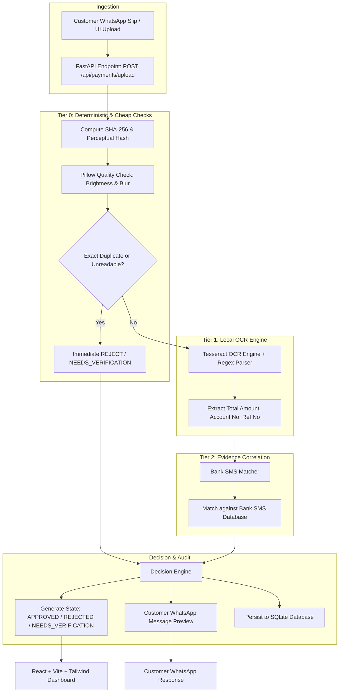

# PayGuard: Automated Bank Payment Verification System

> **BuildStart Software Engineering Intern — 2-Day Engineering Challenge**  
> A reliable, ultra-low-cost, multi-tiered verification system designed to determine whether a customer's bank transfer payment slip submitted via WhatsApp can be safely accepted using available business evidence.

---

## 1. Executive Summary & Objective

BuildStart creates AI WhatsApp Agents for businesses. In Sri Lanka and emerging markets, bank transfers are widely used, but there are **no direct bank verification APIs** available. Businesses must rely on available multi-source evidence:
- **Payment slip images** (photographs or digital screenshots)
- **Extracted receipt metadata** (amount, date, reference, account)
- **Order context** (expected amount, expected receiving account)
- **Customer context** (name, phone number)
- **Bank SMS notifications** received by the business SIM card
- **Historical payment submissions** (image hashes and prior transaction history)

**PayGuard** evaluates incoming payment evidence through a 3-tier escalating pipeline to produce one of three actionable decisions:
1. **`APPROVED`**: High confidence; slip details match order context and correlate with an incoming bank credit SMS notification.
2. **`REJECTED`**: Definite fraud or hard mismatch; duplicate screenshot, wrong bank account, or amount discrepancy.
3. **`NEEDS VERIFICATION`**: Ambiguous; blurry image, missing bank SMS notification, or simultaneous similar payments requiring human review.

---

## 2. Architecture Overview



---

## 3. The 3-Tier Verification Pipeline

The system is designed to achieve the **lowest practical cost** while maximizing fraud prevention and verification accuracy:

### **Tier 0: Deterministic & Cheap Checks (`cheap_checks.py`)**
- **Execution Cost**: Free (CPU-only, <5ms latency).
- **Exact Duplicate Detection**: Computes `SHA-256` of the raw image bytes. If an identical file has been used before, it flags `EXACT_DUPLICATE` and rejects immediately.
- **Perceptual Near-Duplicate Detection (`pHash`)**: Computes a 64-bit perceptual image hash (Hamming distance $\le 6$). Catches re-saved, cropped, compressed, or slightly modified screenshots of prior transactions (`NEAR_DUPLICATE_IMAGE`).
- **Image Quality Assessment**: Analyzes pixel brightness and edge energy via `Pillow`. Dark or severely degraded images are flagged (`LOW_QUALITY_BLUR`, `LOW_QUALITY_DARK`) before spending compute on OCR.
- **Sanity Rules**: Checks payment age (>30 days old flagged as `OLD_PAYMENT`).

### **Tier 1: Text Extraction & OCR (`ocr_service.py`)**
- **Execution Cost**: Minimal (Local Tesseract engine, runs only on clean, non-duplicate slips).
- Preprocesses images into high-contrast grayscale.
- Extracts structured fields using resilient regex patterns:
  - **Amount**: Prioritizes `Total Amount` and `Total` before generic `Amount` or `Rs./LKR` lines.
  - **Account Number**: Recognizes full account numbers, masked accounts, and hyphenated formats (e.g. `000-0000-000`).
  - **Reference ID**: Extracts transaction references and receipt identifiers (e.g. `Ref 839201`).

### **Tier 2: Bank SMS Evidence Correlation (`sms_matcher.py`)**
- **Execution Cost**: Local database lookup.
- Matches extracted slip information against incoming bank credit notifications:
  - **Exact Match (Amount + Ref No)**: High confidence (100%).
  - **Amount-Only Match**: Medium confidence (60%), flags uncertainty if multiple transactions have identical amounts.
  - **Missing SMS**: Flags `NO_SMS_MATCH` and routes to `NEEDS_VERIFICATION` (SMS may be delayed by carrier).

---

## 4. Decision Engine & Confidence Scoring

The decision engine (`decision_engine.py`) aggregates signals across all tiers:

| Scenario | Tier 0 Output | Tier 1 (OCR) | Tier 2 (SMS) | Final Decision | Confidence |
| :--- | :--- | :--- | :--- | :--- | :--- |
| **Normal Payment** | Clean quality, unique hash | Matches Order Amount (Rs. 25,000) | Exact match with bank SMS | **`APPROVED`** | 95% |
| **Wrong Amount** | Amount mismatch flagged | Read Rs. 10,000 (Order: Rs. 15,000) | No matching SMS | **`REJECTED`** | 90% |
| **Duplicate Slip** | `EXACT_DUPLICATE` (SHA-256 match) | *(Skipped)* | *(Skipped)* | **`REJECTED`** | 99% |
| **Reused / Cropped Slip** | `NEAR_DUPLICATE_IMAGE` (pHash match) | Read previous transaction | SMS already claimed | **`REJECTED`** | 95% |
| **Unclear / Blurry Slip** | `LOW_QUALITY_BLUR` | *(Skipped)* | No matching SMS | **`NEEDS_VERIFICATION`** | 10% |
| **Delayed Bank SMS** | Clean quality, unique hash | Matches Order Amount | No matching SMS found yet | **`NEEDS_VERIFICATION`** | 40% |

---

## 5. Information Privacy: Customer vs. Business Separation

To maintain customer trust without leaking internal security heuristics:
- **Internal Dashboard (Business View)**: Displays technical audit logs, exact duplicate IDs, perceptual Hamming distances, OCR bounding raw text, confidence scores, and raw bank SMS records.
- **Customer WhatsApp Response**: Provides friendly, non-technical, actionable instructions without revealing fraud detection rules:
  - *Blurry*: `"We couldn't clearly read the payment slip. Please send a clearer image of the complete slip."`
  - *Duplicate*: `"This payment appears to have already been used for another order. Please send the correct payment slip."`
  - *SMS Delayed*: `"The payment appears valid, but the transaction cannot currently be matched with a bank notification. Please wait or contact the business."`

---

## 6. Local Setup & Running the Application

### **Prerequisites**
- **Python 3.12** (installed via Homebrew or system)
- **Node.js** (v18+ or v20+) & `npm`
- **Tesseract OCR** (e.g. `brew install tesseract`)

---

### **Step 1: Backend Setup**

```bash
# 1. Navigate to project root
cd /Users/dulnithliyanage/Academics/payguard

# 2. Activate Python 3.12 virtual environment
source .venv/bin/activate

# 3. (Optional) Install dependencies if needed
pip install -r requirements.txt

# 4. Seed demo scenarios and database
cd backend
python scripts/seed_data.py

# 5. Start the FastAPI server
uvicorn app.main:app --host 0.0.0.0 --port 8000
```
> Backend runs at **http://localhost:8000** (Interactive Swagger docs: **http://localhost:8000/docs**).

---

### **Step 2: Frontend Setup**

In a **second terminal tab**:

```bash
# 1. Navigate to frontend directory
cd /Users/dulnithliyanage/Academics/payguard/frontend

# 2. Install dependencies (if not already installed)
npm install

# 3. Start Vite development server
npm run dev
```
> Frontend runs at **http://localhost:5173**.

---

### **Step 3: Running Tests**

In project root:

```bash
source .venv/bin/activate
pytest -v
```
All **17 unit and integration tests** cover Tier 0 checks, OCR parsing, SMS correlation, Decision Engine logic, and FastAPI REST endpoints.

---

## 7. Short Engineering Report

### **1. How the Solution Works**
PayGuard is organized as an escalating state machine. When an image arrives via WhatsApp or the upload API, Tier 0 computes deterministic hashes and evaluates image quality. If clean, Tier 1 uses Tesseract OCR to extract payment parameters, and Tier 2 correlates them against bank SMS notifications. The decision engine evaluates conflicting evidence and determines whether to approve, reject, or request manual review.

### **2. How We Verify a Payment Belongs to an Order**
1. **Receiving Account Match**: Verifies that the slip deposit account matches the business account number assigned to the specific order.
2. **Amount Equality**: Compares extracted amount with `Order.expected_amount_lkr`.
3. **Reference & Timing Window**: Checks the transaction timestamp against the order creation window (rejecting payments dated before order creation or older than 30 days).
4. **Bank SMS Confirmation**: Verifies an incoming SMS credited the exact amount with the matching reference number.

### **3. How We Detect Duplicate / Reused Payments**
- **Exact Duplicates**: Evaluated in $<1\text{ms}$ using `SHA-256` exact hash match.
- **Cropped, Filtered, or Altered Screenshots**: Perceptual hashing (`pHash`) generates an image fingerprint that remains invariant under minor cropping, resizing, or JPEG compression. If the Hamming distance is $\le 6$, it identifies the original submission ID.
- **Reused Reference Number**: Database query detects if the reference number has already been verified for another completed order.

### **4. How We Handle Suspicious or Manipulated Slips**
- **Font & Layout Inconsistencies**: Low OCR confidence or irregular spacing triggers manual verification.
- **Reference Regex Validation**: Validates that transaction references follow standard banking alphanumeric patterns (`[A-Za-z0-9]{4,20}`).
- **Cross-Evidence Validation**: An edited slip displaying "Rs. 50,000" will fail Tier 2 SMS verification because no corresponding bank SMS exists in the business account.

### **5. How We Use Bank SMS Information**
Bank SMS notifications are treated as the **ground truth** for fund arrival. In the absence of an open banking API, bank SMS confirms that money is actually credited. PayGuard accommodates real-world conditions:
- **Delayed SMS**: When a slip is valid but the SMS hasn't arrived yet, the system sets status to `NEEDS_VERIFICATION` rather than falsely rejecting.
- **Multiple Similar Payments**: If three customers pay `Rs. 5,000` at the same time, the system avoids assuming amount match equals identity; it requires reference correlation or holds for verification.

### **6. How We Minimise Cost**
- **Tiered Escalation**: 100% of duplicate slips and blurry files are halted at Tier 0 without running OCR or AI.
- **Zero Expensive Cloud API Dependency**: Uses local CPU-based Tesseract OCR and perceptual hashing instead of paying per-request vision API fees.
- **Hash Caching**: Image hashes prevent duplicate compute cycles on repeated submissions.
- **Blended Cost**: Estimated external API cost is **$0 per 1,000 requests** on current architecture, with an escalation path to cloud vision only for the top 5% most ambiguous cases.

### **7. Major Limitations**
- **Complex Backgrounds / Handwritten Receipts**: Traditional OCR can struggle with noisy handwritten deposit slips (mitigated by routing to `NEEDS_VERIFICATION`).
- **Single Bank SMS Format Assumptions**: Prototype regexes are tuned for standard Sri Lankan bank formats (BOC, Commercial Bank, HNB, Sampath).
- **SQLite Concurrency**: Prototype uses SQLite; production requires PostgreSQL with connection pooling.

### **8. Evolution for Production Scale (100,000+ submissions/month)**
1. **Asynchronous Task Queue**: Decouple image processing using Celery / Redis / AWS SQS workers so WhatsApp webhooks return immediate HTTP 200 responses.
2. **Object Storage**: Store images in AWS S3 or Cloudflare R2 with pre-signed URLs rather than local disk.
3. **SMS Ingestion Webhook**: Android SMS gateway app or carrier aggregator (Twilio / Dialog Axiata) pushing bank SMS directly into an encrypted message queue.
4. **Hybrid AI Model Escalation**: Run local Tesseract first; only if confidence is $<70\%$ or an anomaly is detected, escalate to a vision model (e.g. Gemini 1.5 Flash / Claude Haiku) with strict token budgets.
5. **Human-in-the-Loop Review Dashboard**: WebSocket-enabled review interface for support staff with quick 1-click approve/reject actions for payments flagged as `NEEDS_VERIFICATION`.

---

## 8. Debugging Methodology (Documented Problems)

| # | Problem | Root Cause | Identification Method | Solution & Outcome |
| :--- | :--- | :--- | :--- | :--- |
| **1** | `TypeError: descriptor '__getitem__' requires a 'typing.Union'` on startup. | Homebrew defaulted to experimental Python 3.14, which had breaking internal changes in `typing.Union` unsupported by SQLAlchemy 2.0. | Inspected uvicorn stack trace originating from `sqlalchemy/util/typing.py`. | Created `.venv` using stable Python 3.12 (`/opt/homebrew/bin/python3.12`). App started cleanly. |
| **2** | Clean digital receipt screenshots falsely marked as `LOW_QUALITY_BLUR`. | Contrast and edge energy thresholds in `cheap_checks.py` were tuned for photos. Digital templates with white backgrounds have low overall image variance. | Tested uploaded receipt with standalone diagnostic script inspecting `QualityMetrics`. | Adjusted contrast threshold from `25.0` to `10.0`. Digital receipts now pass to OCR seamlessly. |
| **3** | OCR read subtotal (`16.50`) instead of Total (`19.00`), and missed hyphenated accounts. | Regex searched for the first occurrence of `Amount` and only allowed pure digits for account numbers. | Inspected OCR raw text dump and compared against parsed regex output. | Updated regex to prioritize `Total Amount` / `Total` and allow hyphenated account numbers (`000-0000-000`). |

---

## 9. Project Structure

```
payguard/
├── README.md                      # Comprehensive documentation & engineering report
├── requirements.txt               # Backend Python dependencies
├── pyproject.toml                 # Pytest & tool configurations
├── .gitignore                     # Git ignore rules
│
├── backend/                       # FastAPI Backend
│   ├── app/
│   │   ├── main.py                # FastAPI entry point & CORS configuration
│   │   ├── db.py                  # Database engine & session management
│   │   ├── models/                # SQLAlchemy database models
│   │   │   ├── customer.py        # Customer profile & phone
│   │   │   ├── order.py           # Order details & expected amount
│   │   │   ├── bank_sms.py        # Bank credit SMS notification records
│   │   │   ├── payment_submission.py # Uploaded slip evidence & hashes
│   │   │   └── verification_result.py# Verification decisions & bot message
│   │   ├── api/
│   │   │   └── payments.py        # Dashboard & upload API routes
│   │   └── verification/          # 3-Tier Verification Engine
│   │       ├── cheap_checks.py    # Tier 0: SHA-256, pHash, Image Quality
│   │       ├── ocr_service.py     # Tier 1: Tesseract OCR extraction
│   │       ├── sms_matcher.py     # Tier 2: Bank SMS correlation
│   │       └── decision_engine.py # Decision state machine & confidence
│   ├── images/                    # Stored evidence receipts & demo slips
│   └── scripts/
│       ├── seed_data.py           # Database seeder for core test scenarios
│       └── generate_images.py     # Slip image generator
│
├── frontend/                      # React + Vite + Tailwind Dashboard
│   ├── src/
│   │   ├── App.tsx                # Verification Dashboard & Upload Modal
│   │   ├── main.tsx               # React application root
│   │   └── index.css              # Tailwind CSS styles
│   ├── package.json               # Frontend dependencies
│   └── vite.config.ts             # Vite build configuration
│
└── tests/                         # Automated Pytest Suite (17 tests)
    ├── conftest.py                # Database & order fixtures
    ├── api/
    │   └── test_payments_api.py   # REST API integration tests
    └── verification/
        ├── test_cheap_checks.py   # Tier 0 hashing & sanity tests
        ├── test_ocr_service.py    # Tier 1 OCR extraction tests
        ├── test_sms_matcher.py    # Tier 2 Bank SMS correlation tests
        └── test_decision_engine.py# Decision Engine decision tests
```

---

## 10. License
MIT License. Developed for the BuildStart Engineering Challenge.
